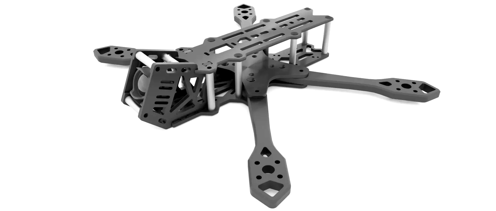
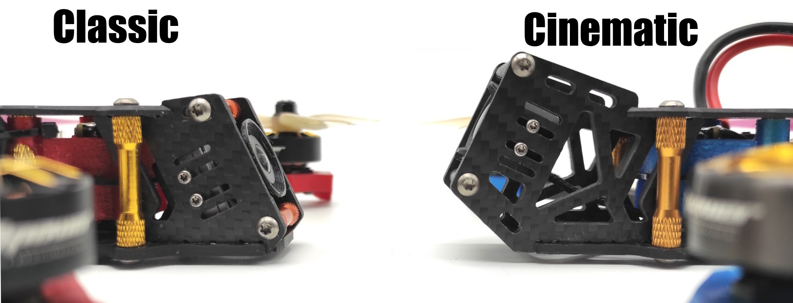
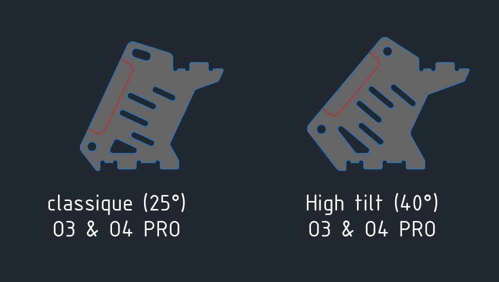
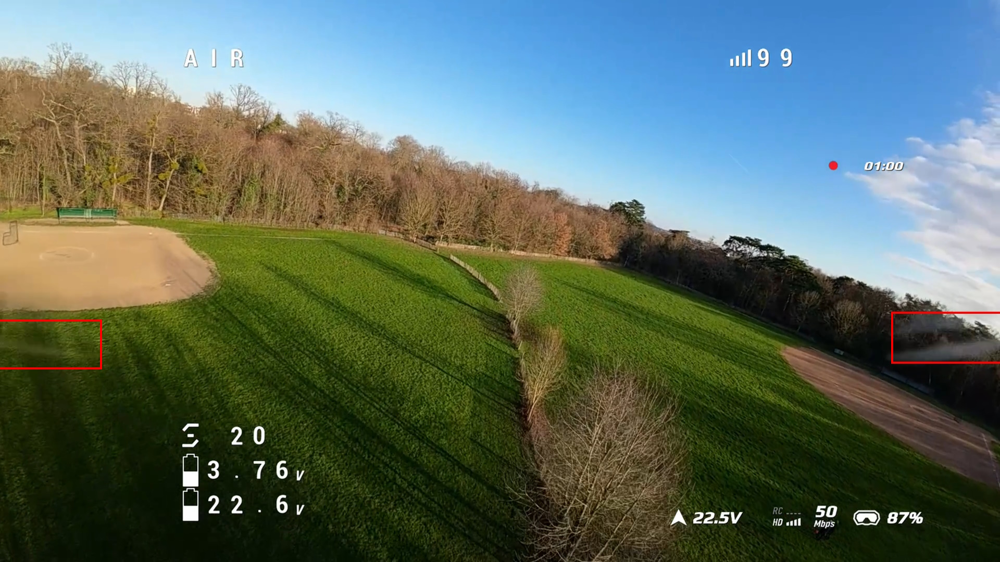
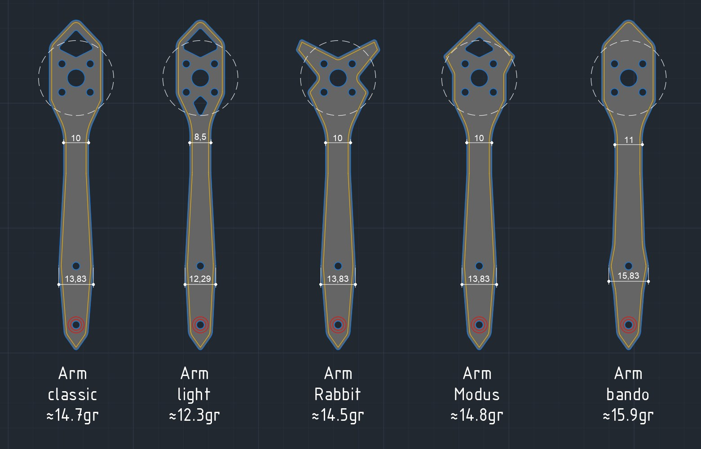
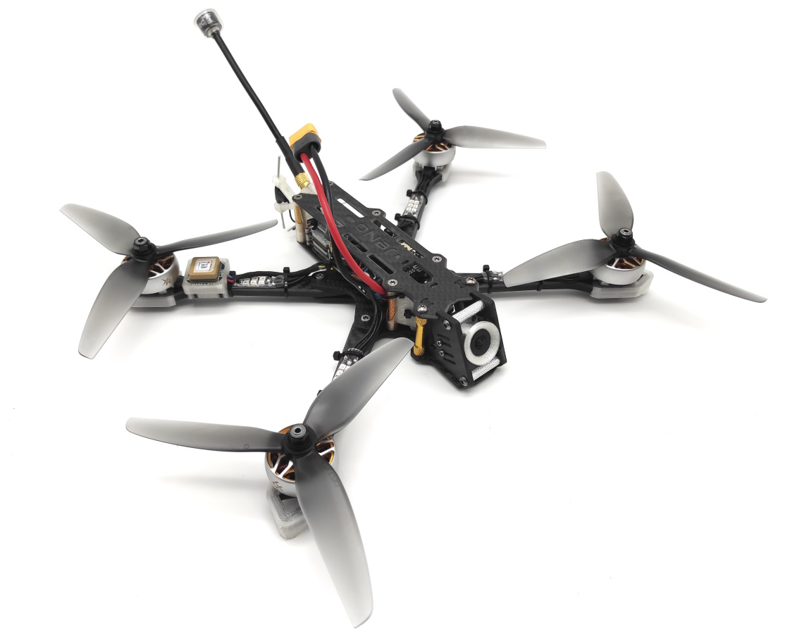
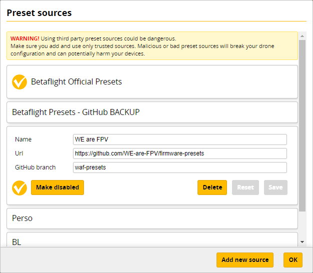

[](https://creativecommons.org/licenses/by/4.0/)
> [!NOTE]
> Current version : **1.5.1** (read [changelog](#changelog) for details)


# JeNo 5.1"
***5.1" drone FPV frame compatible with Air Unit O3 and O4 Pro, designed for Freestyle, Freeride and Cinematic. Many customizable options are available.***

> [!NOTE]
> Designed in France by members of the [WE are FPV](https://www.wearefpv.fr/) community, the JeNo is already flown by hundreds of pilots and is now being sold by [Drone FPV Racer](https://www.drone-fpv-racer.com/recherche?controller=search&s=JeNo+5.1+frame&aff=64&id_campaign=13) (affiliate link). The French version of the project is available on [Printables](https://www.printables.com/fr/model/339099-jeno-51-drone-frame). Note that a [3-3.5" version](https://github.com/WE-are-FPV/JeNo-3-3.5) and a [7" version](https://github.com/WE-are-FPV/JeNo-7) of the JeNo exist.


## Table of contents

* [Key features](#key-features)
* [Presentation](#presentation)
* [Detailed specifications](#detailed-specifications)
* [Versions and files](#versions-and-files)
* [Customization](#customization)
* [Buy it or cut it !](#buy-it-or-cut-it-)
* [Bill of materials](#bill-of-materials)
* [Building/Assembly guide](#buildingassembly-guide)
* [Inspiration](#inspiration)
* [Tuning, Betaflight Preset](#tuning-betaflight-preset)
* [Blackbox](#blackbox)
* [Videos](#videos)
* [Builds examples](#builds-examples)
* [Authors](#authors)
* [TPU](#tpu)
* [Community (remixes and TPU)](#community-remixes-and-tpu)
* [Changelog](#changelog)

## Key features
- [x] **Sturdiness** and **rigidity** (6 mm arms)
- [x] Excellent flight **performances**, easy to tune
- [x] **Wide-X** geometry
- [x] Perfect DJI **Air Unit O3 O4 Pro** camera integration
- [x] Designed for : DJI Vista/AU O3/AU O4 Pro, WalkSnail, HDZero, Analogic
- [x] **Frame and standoffs NOT visible** in video feed, with any FPV camera
- [x] Stack **decoupled** from the arms
- [x] **Easy maintenance** : remove 2 screws to replace an arm
- [x] **Roomy** (30 mm high)
- [x] **Customizable** (weight, arms, camera plates)

## Presentation
The **JeNo** is a 5.1" frame designed for the **DJI Air Unit O3**, which is not compatible with most of existing frames. It was designed to ensure that the frame is not visible in the camera's field of view (FOV) while providing good lens protection. It is also compatible with the O3 camera's ND filters.

The JeNo is now compatible with the **JI Air Unit O4 Pro** (but make sure to use vertical ND filters, like [those from GEPRC](https://geprc.com/product/geprc-dji-o4-air-unit-pro-filter/)).

Originally intended for freestyle flying, **flight quality** and **durability** were at the core of its design (see BlackBox at the bottom of the page).

The issue of obstructed FOV due to standoffs or the frame itself is exacerbated with the O3/O4 Pro camera, but this issue already exists in many frames with other cameras. The JeNo allows for a clear FOV **with any camera** and is **not exclusively dedicated to the O3/O4 Pro**.

It is optimized for a 25° camera tilt but can support FOVs ranging from 0° to ~40°. A high tilt option is also available.

This new ability to film in **4K without needing an Action Cam** saves between 70g (Action 2) and 165g (GoPro 11) (plus TPU). For the standard version of the JeNo, we decided to add 20g to the frame to have a **rigid and sturdy tank**, totaling up to **~140g**. However, it still allows for the option of carrying an Action Cam.

A set of **[optimized TPU for bando bashing](https://github.com/WE-are-FPV/JeNo-5.1/tree/main/tpu/bando_edition)** is also available to guarantee the best durability.

With a DJI Air Unit O3/O4 Pro, you benefit from a **lighter and more robust** setup compared to traditional frames, with a clear FOV.


A **Light version** will allow you to maintain a more typical weight around **120g**.

The JeNo was initially designed for Freestyle flying, which is why it features a "Wide-X" geometry. This design allows for good handling while reducing the amount of **visible propellers in the FOV** compared to a "True-X" frame (though some propellers may still be visible). A **"Cinematic" option** provides **elongated camera plates** for a **"Wide" FOV without visible propellers**.



Several pattern options for the arm are also available.

Finally, as this frame was designed by members of the [WE are FPV](https://www.wearefpv.fr/) community, a "WaF edition" is available (the logo is engraved on the bottom plate, you can remove it if you prefer). Join us on the WAF forum in [the official JeNo 5.1" thread](https://forum.wearefpv.fr/topic/19574-jeno-51-un-ch%C3%A2ssis-custom-modulaire-avec-fov-d%C3%A9gag%C3%A9-o3) to discuss it further.


The JeNo is also available in [3" and 3.5" versions](https://github.com/WE-are-FPV/JeNo-3-3.5).

We recently added a [7" version](https://github.com/WE-are-FPV/JeNo-7).

## Detailed specifications

||| 
| :--- | :--- |
| **Geometry** | Wide-X | 
| **Props size** | 5.1" (or 6" with optional arms) | 
| **Weight** | 120 to 145 g depending on options, with screws | 
| **Arms** | 6 mm | 
| **Body height** | 30 mm | 
| **Stack height** | 21.5 mm | 
| **Bottom plate** | 2.5 or 3 mm depending on options | 
| **Middle plate** | 2.5 mm | 
| **Top plate** | 2 mm | 
| **Camera plates** | 3 mm | 
| **Motors mounting** | 16 mm | 
| **Camera** | 20 mm (DJI), Micro, Nano. Clear FOV. Ajustable.
| **Main stack** | 30.5 mm x 30.5 mm and 20 mm x 20 mm | 
| **Back stack** | 20 mm x 20 mm and 25 .5 x 25.5 mm | 
| **Supported VTX** | Analogic, DJI Vista, DJI Air Unit O3/O4 Pro, WalkSnail, HDZero… | 
| **Strap passage** | Yes | 
| **XT60 passage** | Yes (front and back) + passage for a zip tie | 

## Versions and files

### Versioning
You will find the **current version** of the frame at the beginning of the description and the full [history of modifications](#changelog) at the end of the page.

We strongly recommend always cutting the latest version to ensure you benefit from the most recent optimizations.

The version **number format** is as follows :
```
<Major versions>.<Minor version>.<Revision>
ex : 1.3.2
```

* **Revision :** This number is incremented in the case of minor modifications with no significant impact.
* **Minor version :** This number is incremented for minor modifications that may potentially break compatibility with certain TPU parts.
* **Major version :** This number is incremented for significant modifications that break compatibility at the carbon level.

Since the creation of the JeNo 5", we have always strived to **maintain compatibility at the carbon level**. As a result, the version remains “1.x.y.”

In practical terms, this means that if you have the very first version of the JeNo 5" and want to equip it with the **O4 Pro**, you only need to have new camera plates cut—they will be compatible with your frame version!

**Note :** If you develop TPU parts for the JeNo, be sure to specify the version they are compatible with.

### Files management
To simplify things, we have reorganized the file structure. The files are now divided into **five groups** :

* **01-FRAME :** Contains **models** describing the **frame** in DXF, STEP, and STL formats for the current version. Also contains a PDF file which is a reformatted version of the DXF.
* **02-TPU :** Contains **TPU models** for the current frame version in STL format.
* **03-FRAME-HISTORY :** Contains previous versions of the frame.
* **04-TPU-HISTORY :** Contains TPU models that are no longer compatible with the current version.
* **OTHER-FILES :** Contains documentation files, including the assembly manual and a description.

The major change is that all options are now consolidated into a single file. This will make version management significantly easier for us.

If you want to view the DXF file with all annotations, we recommend using the free software [DWG TrueView](https://www.autodesk.com/products/dwg-trueview/overview). If you prefer not to use it, the PDF version of the file will contain all the necessary information.

## Customization

The JeNo is customizable, offering several **options** to best adapt to different needs and individual preferences.

To have a complete frame, you will need to choose:

* A **base** (bottom, middle, top plate, and arm spacer)
* A type of **camera plates**
* A model of **arms**

> [!TIP]
> All components are compatible with each other.

Here is a preview of the "menu card" and its various options:


### The Base
This concerns the core of the frame (bottom, middle, top plates, and arms key).

* **Priority :** The Classic version (sturdy) features a 2.5mm bottom plate, compared to 2mm for the Lightweight version, which is also more "patterned." For the Lightweight version, the weight is approximately 120g depending on the options, compared to approximately 140g for the reinforced (classic) version.
* **Chamfers :** Chamfers have been removed from the files as they are not used by carbon cutters. We recommend applying chamfers to the entire frame, except for the camera plates, for aesthetics, comfort, and durability. Chamfering generally increases the price by around 15%.
* **Edition :** The WE are FPV option adds a "WaF" logo engraved under the bottom plate. You are free to have it removed during cutting or replaced with another design.
* **Bando :** t is the most robust option, with a 3mm thick bottom plate and reinforced arms.

### The Camera Plates

_**Priority :** In the Lightweight version, the carbon is more "patterned," making it slightly more fragile._

* **Classic :** For Freestyle flying, behavior and robustness are prioritized, but the **propellers will be visible in the FOV**.
* **Lightweight :** 2.7g lighter than the Classic plates (1.35g per plate).
* **Cine :** Uses elongated camera plates to remove propellers from the FOV (set to Wide with the O3).
* **Ciné Soft :** The version without soft mounting allows for more adjustment of the camera position. In the case of using the Air Unit O3, the quad must be properly tuned to avoid vibrations in video recording. The soft mounting version limits vibrations that could reach the camera. However we had no vibration with hard mounted O3.
* **High tilt :** allows for a 40° tilt for high tilt adepts
* _**Variable tilt :** variation proposed on [Kamarad70's Thingiverse page](https://www.thingiverse.com/kamarad70/designs)_



> [!CAUTION]
> Note: The coaxial cable sold with the Air Unit O3 (11.5 cm) barely fits with the cinematic camera plates. It is recommended to use a 20 cm coaxial cable (sold by RunCam and AxisFlying).
>
> Air Unit O4 Pro coaxial cable is long enough.

| Freestyle camera plates | Cinematic camera plates |
| :---: | :---: |
|  |  |
|  Props in view |  NO props in view |

### The Arms
Several shapes are available for the arm. Weight, robustness, motor protection, and aesthetics will be the main considerations.

* **"Classic" :** A solid design suitable for Freestyle flying.
* **"Light" :** Some solidity is traded in favor of reduced weight.
* **"Modus" :** The most robust shape that offers the best motor protection. It is also the heaviest arm model.
* **"Rabbit" :** Provides good motor protection with a reasonable weight.
* **"Bando Edition" :** A beefier and stronger model



### The Extras
In the DXF file, you will find additional options. These "extras" cater to more specific needs but remain compatible with the JeNo :

* 6" Arms
* Ultra-light Camera Plates
* High Tilt Camera Plates (40°)
* Top plate with 2 or 3 straps areas
* ...

Feel free to modify the files according to your requirements as well. For example, if you want even more solidity, you can indicate that you would like thicker bottom and top plates (remember to adjust the screw length accordingly).

A 3mm bottom plate for use in bando is an interesting optimization and does not affect the screws length.

||
|:---:|
| Classic Base Light + Light Camera Plates + Classic Arms |

||
|:---:|
| JeNo Classic + 6" Arms |

## Buy it or cut it !

It is up to you : you can get it cut or you can get a classic or cine version directly from Drone FPV Racer or La Camera Embarquée :

* [JeNo Classic by DFR](https://waf.link/JeNo-DFR) (affiliate link)
* [JeNo Cine by DFR](https://waf.link/JeNo-Cine-DFR) (affiliate link)
* [JeNo Classic by La Caméra Embarquée](https://www.lacameraembarquee.fr/we-are-fpv/17793-chassis-we-are-fpv-jeno-51-classic.html) (affiliate link)
* [JeNo Cine by La Caméra Embarquée](https://www.lacameraembarquee.fr/we-are-fpv/17789-chassis-we-are-fpv-jeno-51-cine.html) (affiliate link)

Note: Prices are often excellent in stores, but they don’t always offer the latest version.

The JeNo 5.1" is also available from [CNC Madness](https://cncdrones.com/jeno-5-classic.html) (Canada).

Of course, you can directly contact your favourite carbon fiber cutting service.

The ["01-FRAME"](https://github.com/WE-are-FPV/JeNo-5.1/tree/main/01-FRAME) folder contains all the files you need to get it **cut** in your favourite flavour.

Consult the **DXF file** of the frame (or the PDF version) to choose the version that interests you.

Feel free to select a pre-made "Edition" (Classic, Light, or Bando), or mix different options and choose certain "extras".

You will also need to choose a type of camera plates (classic, cine, etc.).

> [!NOTE]
> All parts versions are compatible with each others

## Bill of materials

In addition to the carbon fiber, you will need the following hardware to complete the assembly of the frame.

**Standoffs**

It is recommended to use 5mm diameter standoffs, especially for those that will serve as support for TPU (backpack and capacitor). Moletted spacers can still be used, but the TPU supports will need to be modified accordingly.

| Quantity | Description | Details |
| :---: | :--- | :--- |
| 8 | M3x30mm standoffs | for the body |
| 2 | M3x20mm standoffs | for the camera |

**Stack materials**

* If 30x30 stack

| Quantity | Description | Details |
| :---: | :--- | :--- |
| 4 | M3x22mm ou M3x20mm countersunk screws | for the stack |
| 4 | M3 nuts for stack screws | |

* If 20x20 stack

| Quantity | Description | Details |
| :---: | :--- | :--- |
| 4 | M2x20mm countersunk screws | for the stack |
| 4 | M2 nuts for stack screws | |

**Frame materials**

| Quantity | Description | Details |
| :---: | :--- | :--- |
| 6 | M3x6/8mm countersunk screws | for the top plate |
| 14 | M3x8mm screws (titanium if possible) | for the bottom and camera plates |
| 8 | Pressnuts ([Flywoo](https://www.drone-fpv-racer.com/flywoo-m3-clinch-nuts-20-pcs-7965.html?aff=64&id_campaign=13#/1063-couleur-titane) or SourceOne alike) | |
| 4 | M3x14mm screws (steel if possible) | for the arms |
| 4 | M3x8mm screws (steel if possible) | for the arms |

**Additional materials**

| Quantity | Description | Details |
| :---: | :--- | :--- |
| 16 | M3x10mm screws (if using arms protections) or M3x8mm (if no TPU) | for the motors |
| 4 | M2x5mm screws | for the camera |

_**In the absence of arm protection, 8mm screws are recommended. 10mm screws are sometimes too long for certain motors and can cause current leaks.**_

**Fasten the lipo**

The JeNo allows the use of non-slip straps thanks to its strap slots. You can also use a LiPo pad if desired.

## Building/Assembly guide

Find numerous examples of builds on the _**DroneBuilds**_ page of WE are FPV.
[](https://forum.wearefpv.fr/71-dronebuilds/ "DroneBuilds - Click to Access!")

The assembly of the frame is straightforward, but here are some clarifications:

* On one of the two sides of the middle plate, there are chamfered holes to accommodate countersunk screws. This side corresponds to the bottom. Remember to install the stack screws before installing the middle plate.
* The press nuts will be positioned on the bottom side of the bottom plate.
* An RX antenna in the shape of a T can be attached to the back of the JeNo using zip ties.
* Six screws on the top plate are countersunk screws to avoid damaging the LiPo battery.

Here is a [video of the JeNo assembly (FR)](https://youtu.be/SF4UAqyNPJ0), and you will find the assembly documentation below, also available here in [PDF format](./OTHER-FILES/JeNo5_Assembly_Guide.pdf).


The assembly is illustrated with cinematic camera plates, which allow the use of up to 4 standoffs (see visual in step 5 below). In practice, 2 standoffs at the front are sufficient, just like with regular camera plates (see step 4).


## Inspiration

The JeNo takes partial inspiration from two other frames:

* The arm locking system of the **Apex**, with **embedded press nuts** at the end of the arms.
* The camera plates are slightly inspired by the **aluminum** cage of the **iFlight Evoque F5X HD V2**. The design is completely different as we use only carbon fiber, but the look is similar.

The rest of the design was guided by the constraints imposed by the Air Unit O3 and its camera, as well as our past experiences with other custom frame designs.

## Tuning, Betaflight Preset

To quickly and fully enjoy the JeNo, a **preset** for **Betaflight 4.4 and 4.5** is available. You just need to add the **WE are FPV repository** to the **preset sources** in Betaflight Configurator.

In the "Preset" tab, click on "Preset sources..." to add the WE are FPV source:

- **Url :** https://github.com/WE-are-FPV/firmware-presets
- **GitHub branch :** waf-presets



Once the source is validated, you simply need to make it "active" to access the JeNo presets under the **"Tune" category** in **version "4.4 or 4.5"**. The preset is available in both **French (FR)** and **English**, and it is indeed the **same tune**.


The preset contains **several options** to select. Note that **by default**, the **tune** is already **quite aggressive**, even without activating the "advanced" tuning options for PIDs and filtering.

## Blackbox

Here is an overview of vibration distribution on the 3 axes for the JeNo "classic Freestyle." This is indeed the unfiltered gyro signal for a 3 minutes freestyle flight :


## Videos
Freestyle with JeNo :

[](https://www.youtube.com/watch?v=Fe3_sJf0j6o "JeNo 5.1 Maiden - Click to Watch!")

JeNo review on WE are FPV (French) :

[](https://www.youtube.com/watch?v=RtPTJsno8Kg "JeNo review on WE are FPV (French) - Click to Watch!")

## Builds examples

You can find many build examples on [WE are FPV's DroneBuilds](https://forum.wearefpv.fr/71-dronebuilds/) and [RotorBuilds](https://rotorbuilds.com) :

* en : [JeNo 5.1" WE are FPV O3](https://rotorbuilds.com/build/31216)
* fr : [Iron JeNo 5.1" (Vista)](https://forum.wearefpv.fr/topic/20347-iron-jeno-51-vista/)
* fr : [JeNo - DJI Air Unit O3 (5" 6S)](https://forum.wearefpv.fr/topic/19543-jeno-dji-air-unit-o3-5-6s/)
* fr : [JeNo 6" cine/midrange](https://forum.wearefpv.fr/topic/20536-jeno-6-cinemidrange/)
* fr : [JeNo 5.1" Hybride](https://forum.wearefpv.fr/topic/20239-jeno-51-hybride/)
* fr : [JeNo 5" Cam Plate Ciné](https://forum.wearefpv.fr/topic/19995-jeno-5-cam-plate-cin%C3%A9)
* ...

## Authors

The JeNo was designed by :

* nochamo - [Youtube](https://www.youtube.com/user/nochamo)
* Jerome / Jéjé FPV - [Youtube](https://www.youtube.com/@jejefpv)
* MotardGeek - [Youtube](https://www.youtube.com/@MotardgeekFr91) (requester and tester for Light version)

## TPU

Among the downloadable files, you will find a variety of TPU to protect your JeNo and different Action Cams.

Even more interestingly, in collaboration with **Alex**, also known as [Heim FPV](https://www.youtube.com/@heim_fpv589), from the **__#bandolovers__** team, we have designed a set of [TPU parts optimized for bando flying](https://github.com/WE-are-FPV/JeNo-5.1/tree/main/tpu/bando_edition). If you're looking to reinforce your JeNo to the maximum extent, this kit is tailored for you. It includes:

* A **front bumper** that will safeguard the entire camera cage and assist in absorbing frontal impacts. It is available for classic, cine and high tilt camera plates.
* A **back bumper** for worry-free matty flips (it also allows for attaching the RX antenna).
* A much sturdier and encompassing **VTX antenna support**, with an inclination that better tolerates impacts from the rear (available in O3 and "cherry" versions). 2 holes allow for an easy antenna ejection if required.
* 2 new **arm protections**, offering not only better arm protection but also motor protection. The first version is "clippable" and replaceable without disassembling the motors. The second completely encases the arm tips and has no chance of being ejected during a crash.
* An optimized **DJI Action 2 mount** for bando flying, without an ND filter, available in 20 and 25-degree versions (not the one on the photo here under, which is the classic version).
* A new **DJI Action 2 mount** remixed from [T4 Max FOV Action 2 DJI TPU Drone Mounts](https://www.printables.com/fr/model/217897-t4-max-fov-action-2-dji-tpu-drone-mounts) par [t4obrien](https://www.printables.com/fr/@t4obrien). It allows to secure the camera with a strap.


If the cap of your Air Unit O3 antenna is lost, several designs are [available here](https://www.printables.com/fr/model/556697-dji-air-unit-o3-antenna-cap-3-versions) for replacement.

## Community (remixes and TPU)

**Fork/remix**
* [Platy FPV](https://www.youtube.com/channel/UCqOLDBE34WiqytAgCRManAg) has reimagined the JeNo to suit his needs: lighter, shorter, low profile, and with a split deck. Find all the details of the [JeNo 5.1" - PlatyStyle Edition](https://www.printables.com/fr/model/744619-jeno-51-platystyle-edition) on their Printables page and on the [WE are FPV forum](https://forum.wearefpv.fr/topic/22236-jeno-51-platystyle-un-jeno-sous-hormones).


* [Kamarad70 (Rotor-Vision)](https://www.youtube.com/channel/UCQ9MUpBuCL820obqPXN7wsw) offers a variation of the JeNo camera plates on [his Thingiverse page](https://www.thingiverse.com/kamarad70/designs), allowing for an adjustable tilt (from -20° to approximately +40°). You will also find the associated [FPV camera mount](https://www.thingiverse.com/thing:6627268), a [front bumper](https://www.thingiverse.com/thing:6627192), and an [Action Cam support base](https://www.thingiverse.com/thing:6627160).

**TPU**

In addition to the TPU options available on this page, you will find here some TPU designs created by the community.

* [Pulse FPV](https://www.youtube.com/channel/UCUWnkQ2-IbQYc6LpTXz01qw) has created an impressive collection of high-quality TPU designs, which can be found on his [Thingiverse page](https://www.thingiverse.com/thing:5804682).


* [Bard FPV](https://www.youtube.com/@bardfpv) also offers us some interesting TPU designs on their [Thingiverse page](https://www.thingiverse.com/bardfpv/designs), including fins to protect the LiPo and facilitate the turtle mode.


* [Support GP9, Walksnail, GPS, ViFly etc.](https://www.thingiverse.com/-kc-/designs) by [kC](https://www.youtube.com/@kCer)
* [Modus rising arm protection](https://www.printables.com/fr/model/830201-jeno-51-protection-bras-modus) to safeguard the bells, [short double antenna backpack](https://www.printables.com/fr/model/830229-jeno-51-support-double-antennes-vista-pour-o3) by [Florian](https://www.printables.com/fr/@FloG_149541/models). 
* Several [GoPro mounts](https://www.printables.com/fr/@PhenXFrame/models) (5 to 7 and 9 to 12) by [Phen X Frame](https://www.printables.com/fr/@PhenXFrame)
* [GoPro Mini 11 mount](https://www.printables.com/fr/model/831787-jeno-51-gopro-11-mini-mount) and other STL files by [L4go](https://www.printables.com/fr/@L4go_1956352)
* [GoPro Mini 11 mount](https://www.printables.com/fr/model/590286-gopro-11-mini-pour-jeno-cine) for JeNo Cine by [shaks](https://www.printables.com/fr/@shaks_729955)
* [O3 case](https://www.printables.com/model/1032747-jeno-bando-o3-casing-ranxfpv), 2 O3 backpacks with fins ([V1](https://www.printables.com/model/976839-jeno-bando-o3-backpack-ranxfpv) and [V2](https://www.printables.com/model/1032734-jeno-bando-o3-backpack-ranxfpv-v2)) and a [front bumper with fins](https://www.printables.com/model/1032740-jeno-bando-bumper-avant-ranxfpv) by [Franck G](https://www.printables.com/@FranckG_2243891)
* Still by [Franck G](https://www.printables.com/@FranckG_2243891), but for the O4 Pro : DJI O4 Pro casing ([V1](https://www.printables.com/model/1144921-jeno-bando-dji-o4-pro-casing-ranxfpv), [V2](https://www.printables.com/model/1168238-jeno-bando-dji-o4-pro-casing-ranxfpv-v2)), [front bando bumper](https://www.printables.com/model/1158816-jeno-o4-pro-bando-bumper-avant-ranxfpv) and [a linear antennas backpack](https://www.printables.com/model/1146819-jeno-bando-dji-o4-o3-backpack-ranxfpv-v3)

## Changelog

> [!TIP]
> Compatibility is consistently maintained between each version: if your frame was a v1, the parts from v1.2 will be compatible. The same applies to TPU accessories. That's why we don't keep the history of previous versions.

* Version **1.5.1** (01/02/2025) : 
  * Support for the **Air Unit O4 Pro** (camera plates + TPU)
  * Widening of the bottom plate around the Air Unit O4
* 01/10/2024 : 
  * STL "JeNo_arm protect_full_socket_bando" from the TPU bando kit updated to fix errors with some slicers
* Version **1.4.0** (02/09/2024) :
  * Modification of the bottom plate on the Classic versions (strength optimization). The "Light" versions remain unchanged.
  * Addition of TPU bando (front bumper and rear bumper) adapted for a 3mm bottom plate.
  * The STL and STEP files have been updated to accommodate the new bottom plate.
* 19/01/2024 :
  * Betaflight 4.5 JeNo Preset added (on WAF repo)
* Version **1.3.1** (13/12/2023) :
  * Hole removed from classic arms
  * Slight optimization of the bottom plate for increased solidity (classic edition only)
  * 2 straps top plate is the new default for increased solidity (classic edition only)
* 08/10/2023 : 
  * Bando arm added (dans “dxf\03_arms”), with no holes and a bit beefer
* 03/09/2023 : 
  * Collection of reinforced TPU optimized for bando added (in “tpu\bando_edition”)
* 08/07/2023 :
  * New top plate with only 2 straps passages to mitigate a weak point if the front strap passage is not needed (in “dxf\04_extras”)
* 24/04/2023 :
  * High tilt camera plates added (in “dxf\04_extras”)
* 09/03/2023 :
  * 6" arms added (in “dxf\04_extras”)
* Version **1.2.0** (Drone-FPV-Racer) :
  * Modification of the top plate with the engraving "JeNo" (the old top plate is still available in "dxf/04_extras").
  * Addition of chamfers on the top plate (for strap routing, XT-60 pass-through).
  * Reinforcements at the back of the bottom plate.
  * Addition of a chamfer on the bottom plate (single face).
  * Extra-light camera plate on the "light"  version (full and base DXF).

## Join the JeNo family !

||
|:---:|
| JeNo Classic Modus (left), JeNo Cine (right), JeNo 6" (top), JeNo 3" (bottom) |