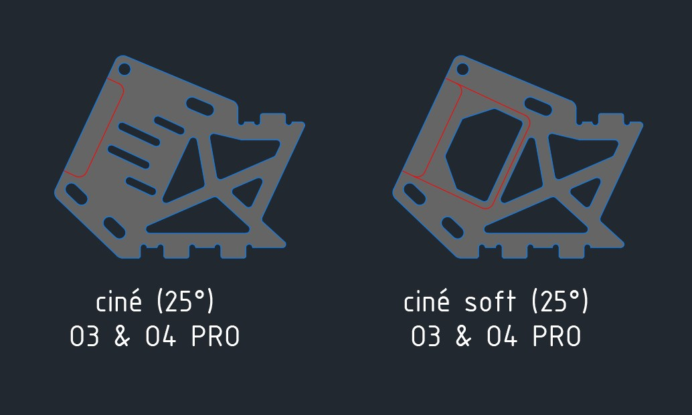
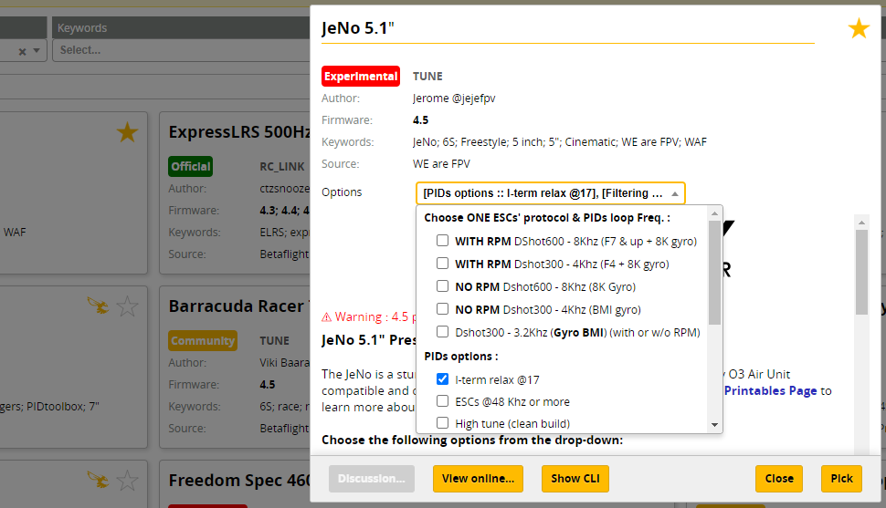

# JeNo 5.1"
_**5.1" drone FPV frame compatible with Air Unit O3 and designed for Freestyle, Freeride and Cinematic. Many customizable options are available.**_

Designed in France by members of the [WE are FPV](https://www.wearefpv.fr/) community, the JeNo is flown by dozens of french pilots and is now being sold by [Drone FPV Racer](https://www.drone-fpv-racer.com/). The French version of the project is available on [Printables](https://www.printables.com/fr/model/339099-jeno-51-drone-frame). Note that a [3-3.5" version](https://www.printables.com/fr/model/459702-jeno-335-drone-frame) of the JeNo exists (French only at the moment).

## Key features
- [x] **Sturdiness** and **rigidity** (6 mm arms)
- [x] Excellent flight **performances**, easy to tune
- [x] **Wide-X** geometry
- [x] Perfect DJI **Air Unit O3** camera integration
- [x] Designed for : DJI Vista/AU O3, WalkSnail, HDZero, Analogic
- [x] **Frame and standoffs NOT visible** in video feed, with any FPV camera
- [x] Stack **decoupled** from the arms
- [x] **Easy maintenance** : remove 2 screws to replace an arm
- [x] **Roomy** (30 mm high)
- [x] **Customizable** (weight, arms, camera plates)

## Presentation
The **JeNo** is a 5.1" frame designed for the **DJI Air Unit O3**, which is not compatible with most of existing frames. It was designed to ensure that the frame is not visible in the camera's field of view (FOV) while providing good lens protection. It is also compatible with the O3 camera's ND filters.

Originally intended for freestyle flying, **flight quality** and **durability** were at the core of its design (see BlackBox at the bottom of the page).

The issue of obstructed FOV due to standoffs or the frame itself is exacerbated with the O3 camera, but this issue already exists in many frames with other cameras. The JeNo allows for a clear FOV **with any camera** and is **not exclusively dedicated to the O3**.

It is optimized for a 25° camera tilt but can support FOVs ranging from 0° to ~40°.

This new ability to film in **4K without needing an Action Cam** saves between 70g (Action 2) and 165g (GoPro 11) (plus TPU). For the standard version of the JeNo, we decided to add 20g to the frame to have a **rigid and sturdy tank**, totaling up to **~140g**. However, it still allows for the option of carrying an Action Cam.

With a DJI Air Unit O3, you benefit from a **lighter and more robust** setup compared to traditional frames, with a clear FOV.

A **Light version** will allow you to maintain a more typical weight around **120g**.

The JeNo was initially designed for Freestyle flying, which is why it features a "Wide-X" geometry. This design allows for good handling while reducing the amount of **visible propellers in the FOV** compared to a "True-X" frame (though some propellers may still be visible). A **"Cinematic" option** provides **elongated camera plates** for a **"Wide" FOV without visible propellers**.

Several pattern options for the arm are also available.

Finally, as this frame was designed by members of the [WE are FPV](https://www.wearefpv.fr/) community, a "WaF edition" is available (the logo is engraved on the bottom plate). Join us on the WAF forum in [the official JeNo 5.1" thread](https://forum.wearefpv.fr/topic/19574-jeno-51-un-ch%C3%A2ssis-custom-modulaire-avec-fov-d%C3%A9gag%C3%A9-o3) to discuss it further.

The JeNo is also available in 3" and 3.5" versions, which can be found on [this Printables page](https://www.printables.com/fr/model/459702-jeno-335-drone-frame).

## Detaileds specifications

||| 
| :--- | :--- |
| **Géometry** | Wide-X | 
| **Props size** | 5.1" (or 6" with optional arms) | 
| **Weight** | 120 à 145 g depending on options, with screws | 
| **Arms** | 6 mm | 
| **Body height** | 30 mm | 
| **Stack height** | 21.5 mm | 
| **Bottom plate** | 2 or 2.5 mm depending on options | 
| **Middle plate** | 2.5 mm | 
| **Top plate** | 2 mm | 
| **Camera plates** | 3 mm | 
| **Motors mounting** | 16 mm | 
| **Camera** | 20 mm (DJI), Micro, Nano. Clear FOV. Ajustable.
| **Main stack** | 30.5 mm x 30.5 mm et 20 mm x 20 mm | 
| **Back stack** | 20 mm x 20 mm et 25 .5 x 25.5 mm | 
| **Supported VTX** | Analogic, DJI Vista, DJI Air Unit O3, WalkSnail, HDZero… | 
| **Strap passage** | Yes | 
| **XT60 passage** | Yes (front and back) + passage for a zip tie | 

## Customization

The JeNo is customizable, offering several **options** to best adapt to different needs and individual preferences.

To have a complete frame, you will need to choose:

* A **base** (bottom, middle, top plate, and arm spacer)
* A type of **camera plates**
* A model of **arms**

**All components are compatible with each other.**

Here is the "menu card" and its various options:

### The Base
This concerns the core of the frame (bottom, middle, top plates, and arms key).

* **Priority :** The Classic version (sturdy) features a 2.5mm bottom plate, compared to 2mm for the Lightweight version, which is also more "patterned." For the Lightweight version, the weight is approximately 120g depending on the options, compared to approximately 140g for the reinforced (classic) version.
* **Chamfers :** The chamfered version is more aesthetically pleasing and slightly stronger. The arms have chamfers on both sides. The top plate is chamfered only on the upper part. Chamfering generally increases the price by around 15%.
* **Edition :** The WE are FPV option adds a "WaF" logo, engraved on the bottom plate.

### The Camera Plates

_**Priority :** In the Lightweight version, the carbon is more "patterned," making it slightly more fragile._

* **Classic :** For Freestyle flying, behavior and robustness are prioritized, but the **propellers will be visible in the FOV**.
* **Lightweight :** 1g lighter than the Classic plates (0.5g per plate).
* **Cine :** Uses elongated camera plates to remove propellers from the FOV (set to Wide with the O3).
* **Ciné Soft :** The version without soft mounting allows for more adjustment of the camera position. In the case of using the Air Unit O3, the quad must be properly tuned to avoid vibrations in video recording. The soft mounting version limits vibrations that could reach the camera.

`Note: The coaxial cable sold with the Air Unit O3 (11.5 cm) barely fits with the cinematic camera plates. It is recommended to use a 20 cm coaxial cable (sold by RunCam and AxisFlying).`

| Freestyle camera plates | Cinematic camera plates |
| --- | --- |
|  |  |

### The Arms
Several shapes are available for the arm. Weight, robustness, motor protection, and aesthetics will be the main considerations.

* **"Classic" :** A solid design suitable for Freestyle flying.
* **"Light" :** Some solidity is traded in favor of reduced weight.
* **"Modus" :** The most robust shape that offers the best motor protection. It is also the heaviest arm model.
* **"Rabbit" :** Provides good motor protection with a reasonable weight.

### The Extras
In the "dxf/04_extras" folder, you will find additional options that cater to more specific needs while remaining compatible with the JeNo frame:

* 6" Arms
* Ultra-light Camera Plates
* High Tilt Camera Plates (40°)
* ...

Feel free to modify the files according to your requirements as well. For example, if you want even more solidity, you can indicate that you would like thicker bottom and top plates (remember to adjust the screw length accordingly).

## Buy it or cut it !

It is up to you : you can get it cut in your favourite flavour and source the materials yourself, or you can get a classic or cine version directly from Drone FPV Racer.

## Bill of materials

In addition to the carbon fiber, you will need the following hardware to complete the assembly of the frame.

**Standoffs**

It is recommended to use 5mm diameter standoffs, especially for those that will serve as support for TPU (backpack and capacitor). Moletted spacers can still be used, but the TPU supports will need to be modified accordingly.

| Quantity | Description | Details |
| :---: | :--- | :--- |
| 8 | M3x30mm standoffs | for the body |
| 2 | M3x20mm standoffs | for the camera |

**Stack materials**

* If 30x30 stack

| Quantity | Description | Details |
| :---: | :--- | :--- |
| 4 | M3x22mm ou M3x20mm countersunk screws | for the stack |
| 4 | M3 nuts for stack screws | for the camera |

* If 20x20 stack

| Quantity | Description | Details |
| :---: | :--- | :--- |
| 4 | M2x20mm countersunk screws | for the stack |
| 4 | M2 nuts for stack screws | for the camera |

**Frame materials**

| Quantity | Description | Details |
| :---: | :--- | :--- |
| 6 | M3x6/8mm countersunk screws | for the top plate |
| 14 | M3x8mm screws (titanium if possible) | |
| 8 | Pressnuts (Flywoo or SourceOne alike) | |
| 4 | M3x14mm screws (steel if possible) | for the arms |
| 4 | M3x8mm screws (steel if possible) | for the arms |

**Additional materials**

| Quantity | Description | Details |
| :---: | :--- | :--- |
| 16 | M3x10mm screws | for the motors |
| 4 | M2x5mm screws | for the camera |

**Fasten the lipo**

The JeNo allows the use of non-slip straps thanks to its strap slots. You can also use a LiPo pad if desired.

## Building/Assembly guide

The assembly of the frame is straightforward, but here are some clarifications:

* On one of the two sides of the middle plate, there are chamfered holes to accommodate countersunk screws. This side corresponds to the bottom. Remember to install the stack screws before installing the middle plate.
* The press nuts will be positioned on the bottom side of the bottom plate.
* An RX antenna in the shape of a T can be attached to the back of the JeNo using zip ties.
* Six screws on the top plate are countersunk screws to avoid damaging the LiPo battery.

Here is a [video of the JeNo assembly](https://www.youtube.com/watch?v=7vlNV8-2Ado), and you will find the assembly documentation below, also available here in [PDF format](./docs/assembly_guide.pdf).

## Inspiration

The JeNo takes partial inspiration from two other frames:

* The arm locking system of the **Apex**, with **embedded press nuts** at the end of the arms.
* The camera plates are slightly inspired by the **aluminum** cage of the **iFlight Evoque F5X HD V2**. The design is completely different as we use only carbon fiber, but the look is similar.

The rest of the design was guided by the constraints imposed by the Air Unit O3 and its camera, as well as our past experiences with other custom frame designs.

## Presets

To quickly and fully enjoy the JeNo, a **preset** for **Betaflight 4.4** is available. You just need to add the **WE are FPV repository** to the **preset sources** in Betaflight Configurator.

In the "Preset" tab, click on "Preset sources..." to add the WE are FPV source:

- **Url :** https://github.com/WE-are-FPV/firmware-presets
- **GitHub branch :** waf-presets

Once the source is validated, you simply need to make it "active" to access the JeNo presets under the **"Tune" category** in **version "4.4"**. The preset is available in both **French (FR)** and **English**, and it is indeed the **same tune**.

The preset contains **several options** to select. Note that **by default**, the **tune** is already **quite aggressive**, even without activating the "advanced" tuning options for PIDs and filtering.

## Blackbox

Here is an overview of vibration distribution on the 3 axes for the JeNo "classic Freestyle." This is indeed the unfiltered gyro signal :

## Videos
Freestyle with JeNo :

JeNo review on WE are FPV (French) :

 - Click to Watch!")

## Builds examples

You can find many build examples on [WE are FPV's DroneBuilds](https://forum.wearefpv.fr/71-dronebuilds/) :

* [Iron JeNo 5.1" (Vista)](https://forum.wearefpv.fr/topic/20347-iron-jeno-51-vista/)
* [JeNo - DJI Air Unit O3 (5" 6S)](https://forum.wearefpv.fr/topic/19543-jeno-dji-air-unit-o3-5-6s/)
* [JeNo 6" cine/midrange](https://forum.wearefpv.fr/topic/20536-jeno-6-cinemidrange/)
* [JeNo 5.1" Hybride](https://forum.wearefpv.fr/topic/20239-jeno-51-hybride/)
* [JeNo 5" Cam Plate Ciné](https://forum.wearefpv.fr/topic/19995-jeno-5-cam-plate-cin%C3%A9)
* ...

## Authors

The JeNo was designed by :

* nochamo - [Youtube](https://www.youtube.com/user/nochamo)
* Jerome / Jéjé FPV - [Youtube](https://www.youtube.com/@jejefpv)
* MotardGeek - [Youtube](https://www.youtube.com/@MotardgeekFr91) (demandeur et testeur de la version Light)

## Community TPUs

In addition to the TPU options available on this page, you will find here some TPU designs created by the community.

[Pulse FPV](https://www.youtube.com/channel/UCUWnkQ2-IbQYc6LpTXz01qw) has created an impressive collection of high-quality TPU designs, which can be found on his [Thingiverse page](https://www.thingiverse.com/thing:5804682).

## Changelog

`Compatibility is consistently maintained between each version: if your frame was a v1, the parts from v1.2 will be compatible. The same applies to TPU accessories. That's why we don't keep the history of previous versions.`

**Version 1.2 (Drone-FPV-Racer) :**

* Modification of the top plate with the engraving "JeNo" (the old top plate is still available in "04 - DXF - EXTRA").
* Addition of chamfers on the top plate (for strap routing, XT pass-through).
* Reinforcements at the back of the bottom plate.
* Addition of a chamfer on the bottom plate (single face).
* Extra-light camera plate on the "light" full and base versions.

