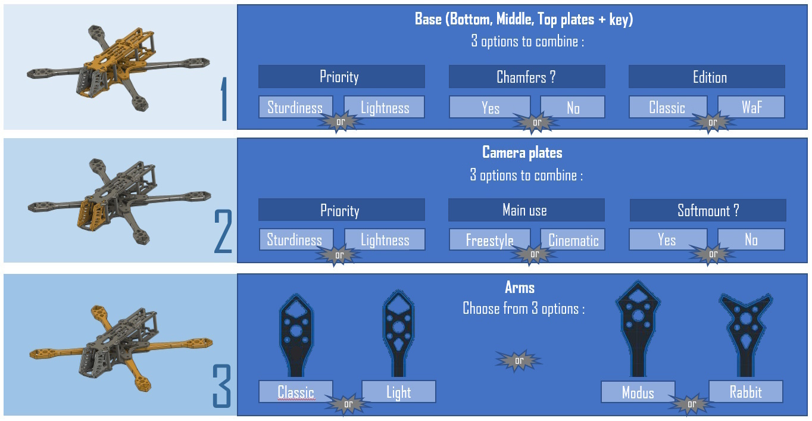

# JeNo-5.1
A 5.1" FPV frame compatible with Air Unit O3 and designed for Freestyle, Freeride and Cinematic. Many customizable options available.

## Key features
- [x] **Sturdiness** and **rigidity** (6 mm arms)
- [x] Excellent flight **performances**, easy to tune
- [x] **Wide-X** geometry
- [x] Perfect DJI **Air Unit O3** camera integration
- [x] Designed for : DJI Vista/AU O3, WalkSnail, HDZero, Analogic
- [x] **Frame and standoffs NOT visible** in video feed, with any FPV camera
- [x] Stack **decoupled** from the arms
- [x] **Easy maintenance** : remove 2 screws to replace an arm
- [x] **Roomy** (30 mm high)
- [x] **Customizable** (weight, arms, camera plates)

## Presentation
The **JeNo** is a 5.1" frame designed for the **DJI Air Unit O3**, which is not compatible with most of existing frames. It was designed to ensure that the frame is not visible in the camera's field of view (FOV) while providing good lens protection. It is also compatible with the O3 camera's ND filters.

Originally intended for freestyle flying, **flight quality** and **durability** were at the core of its design (see BlackBox at the bottom of the page).

The issue of obstructed FOV due to stand-offs or the frame itself is exacerbated with the O3 camera, but this issue already exists in many frames with other cameras. The JeNo allows for a clear FOV **with any camera** and is **not exclusively dedicated to the O3**.

It is optimized for a 25° FOV but can support FOVs ranging from 0° to ~40°.

This new ability to film in **4K without needing an Action Cam** saves between 70g (Action 2) and 165g (GoPro 11). For the standard version of the JeNo, we decided to add 20g to the frame to have a **rigid and solid tank**, totaling up to **140g**. However, it still allows for the option of carrying an Action Cam.

With a DJI Air Unit O3, you benefit from a **lighter and more robust** setup compared to traditional frames, with a clear FOV.

A **Light version** will allow you to maintain a more typical weight around **120g**.

The JeNo was initially designed for Freestyle flying, which is why it features a "Wide-X" geometry. This design allows for good handling while reducing the amount of **visible propellers in the FOV** compared to a "True-X" frame (though some propellers may still be visible). A **"Cine" option** provides **elongated camera plates** for a **"Wide" FOV without visible propellers**.

Several pattern options for the arm are also available.

Finally, as this frame was designed by members of the [WE are FPV](https://www.wearefpv.fr/) community, a "WaF edition" is available (the logo is engraved on the bottom plate). Join us on the WAF forum in [the official JeNo 5.1" thread](https://forum.wearefpv.fr/topic/19574-jeno-51-un-ch%C3%A2ssis-custom-modulaire-avec-fov-d%C3%A9gag%C3%A9-o3) to discuss it further.

The JeNo is also available in 3" and 3.5" versions, which can be found on [this Printables page](https://www.printables.com/fr/model/459702-jeno-335-drone-frame).

## Detaileds specifications

||| 
| :--- | :--- |
| **Géometry** | Wide-X | 
| **Props size** | 5.1" (or 6" with optional arms) | 
| **Weight** | 120 à 145 g depending on options, with screws | 
| **Arms** | 6 mm | 
| **Bus height** | 30 mm | 
| **Stack height** | 21.5 mm | 
| **Bottom plate** | 2 or 2.5 mm depending on options | 
| **Middle plate** | 2.5 mm | 
| **Top plate** | 2 mm | 
| **Camera plates** | 3 mm | 
| **Motors mounting** | 16 mm | 
| **Camera** | 20 mm (DJI), Micro, Nano. Clear FOV. Ajustable.
| **Main stack** | 30.5 mm x 30.5 mm et 20 mm x 20 mm | 
| **Back stack** | 20 mm x 20 mm et 25 .5 x 25.5 mm | 
| **Supported VTX** | Analogic, DJI Vista, DJI Air Unit O3, WalkSnail, HDZero… | 
| **Strap passage** | Yes | 
| **XT60 passage** | Yes (front and back) + passage for a zip tie | 

## Customization

The JeNo is customizable, offering several **options** to best adapt to different needs and individual preferences.

To have a complete frame, you will need to choose:

* A **base** (bottom, middle, top plate, and arm spacer)
* A type of **camera plates**
* A model of **arms**

**All components are compatible with each other.**

Here is the "menu card" and its various options:

### The Base
This concerns the core of the frame (bottom, middle, top plates, and arm spacer).

* **Priority :** The Classic version (sturdy) features a 2.5mm bottom plate, compared to 2mm for the Lightweight version, which is also more "patterned." For the Lightweight version, the weight is approximately 120g depending on the options, compared to approximately 140g for the reinforced (classic) version.
* **Chamfers :** The chamfered version is more aesthetically pleasing and slightly stronger. The arms have chamfers on both sides. The top plate is chamfered only on the upper part. Chamfering generally increases the price by around 15%.
* **Edition :** The WE are FPV option adds a "WaF" logo, engraved on the bottom plate.

### The Camera Plates

_**Priority :** In the Lightweight version, the carbon is more "patterned," making it slightly more fragile._

* **Classic :** For Freestyle flying, behavior and robustness are prioritized, but the **propellers will be visible in the FOV**.
* **Lightweight :** 1g lighter than the Classic plates (0.5g per plate).
* **Ciné :** Uses elongated camera plates to eliminate propellers from the FOV (set to Wide with the O3).
* **Ciné Soft :** The version without soft mounting allows for more adjustment of the camera position. In the case of using the Air Unit O3, the quad must be properly tuned to avoid vibrations in video recording. The soft mounting version limits vibrations that could reach the camera.

`Note: The coaxial cable sold with the Air Unit O3 (11.5 cm) barely fits with the cinematic camera plates. It is recommended to use a 20 cm coaxial cable (sold by RunCam and AxisFlying).`

## Buy it or cut it !

## Bill of materials

## Assembly guide

## Inspiration

## Presets

## Blackbox

## Videos
Freestyle with JeNo :

JeNo review on WE are FPV (French) :

 - Click to Watch!")

## Builds examples

## Community TPUs

## Changelog

